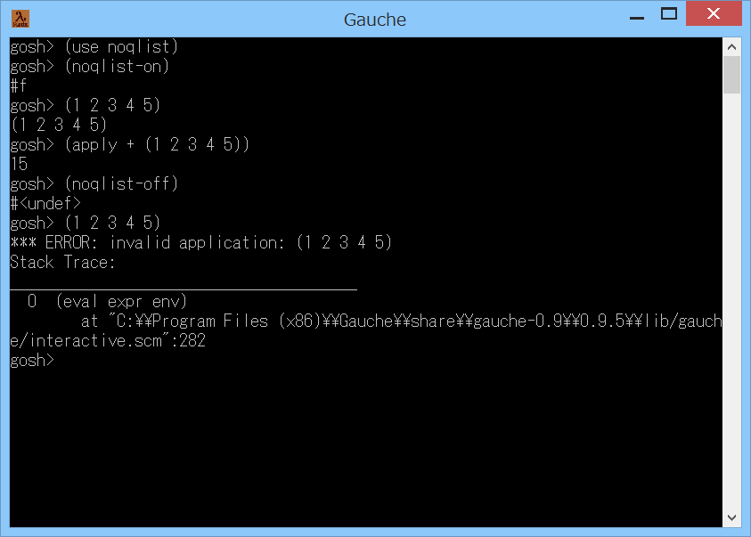

# noqlist



## 概要
- Gaucheでリストの先頭が手続きでなくてもよいモードにするためのモジュールです。  
  例えば (1 2 3 4 5) などと入力してもエラーにならなくなります。  
  現状、いくつかの問題があり実験用という位置づけです。


## インストール方法
- noqlist.scm を Gauche でロード可能なフォルダにコピーします。  
  (例えば (gauche-site-library-directory) で表示されるフォルダ等)


## 使い方
- リストの先頭が手続きでなくてもよいモードにする場合
```
    (use noqlist)
    (noqlist-on)
```

- リストの先頭が手続きでなくてもよいモードを抜ける場合
```
    (noqlist-off)
```

- ジェネリック関数のメソッドの競合について
```
    もし、ジェネリック関数 object-apply に以下のメソッド
      (define-method object-apply ((x <top>) . args) ...
    が、すでに定義されていた場合には、上書きしてしまいます。
    そのような場合は、モードに入るときに
      (define mold (noqlist-on))
    として、元のメソッドを保存してください。
    そして、モードを抜けるときに
      (noqlist-off mold)
    として、元のメソッドに戻してください。
    (ただし、モードに入っている間は、元のメソッドは使用できないので注意)
```


## 注意事項
1. リストの先頭が手続きでなかった場合に、リストをそのまま返すように  
   ジェネリック関数 object-apply にメソッドを追加しています。  
   このため、手続きを作ったつもりがうまくできていなかった場合などに  
   エラーが発生せず、デバッグが困難になる可能性があります。  
   例えば (add 200 300) というリストを評価すると、  
   (define add +) であれば 500 になりますが、  
   (define add 0) であれば (0 200 300) になってしまいます。  
   本モジュールを使っていなければ、後者はエラーとして検出されます。

2. ジェネリック関数 object-apply がグローバルであるため、競合が発生する可能性が  
   あります。例えば、他のモジュールがジェネリック関数 object-apply に  
   文字列用のメソッドを追加したりすると、  
   「なぜか文字列だけはリストにならなくなった」といった現象が発生します。  
   他のあらゆるオブジェクトについても 同様の現象が発生しうるため 注意が必要です。


## 環境等
- OS
 - Windows XP Home SP3
 - Windows 8 (64bit)
- 言語
 - Gauche v0.9.4
 - Gauche v0.9.3.3  

## 履歴
- 2014-8-28 v1.00 (初版)
- 2014-8-28 v1.01 コメント修正のみ
- 2014-8-28 v1.02 コメント修正のみ
- 2014-8-28 v1.03 コメント修正のみ
- 2014-8-28 v1.04 コメント修正のみ
- 2014-8-29 v1.05 コメント修正のみ
- 2014-8-31 v1.06 コメント修正のみ


(2014-8-31)
